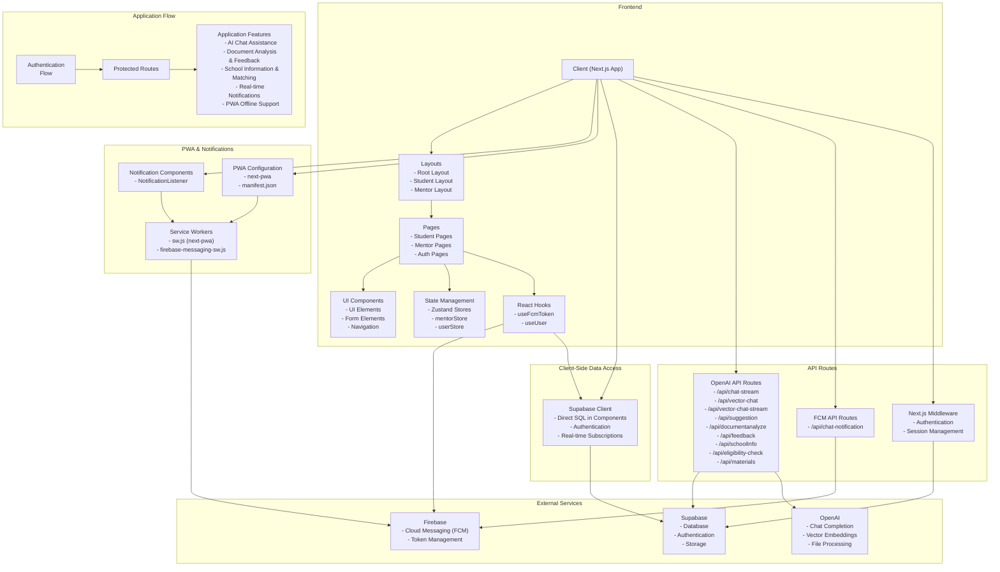

<p align="center">
  
</p>

<h1 align="center">Magic Prep Academy</h1>

<p align="center">
  <a href="https://vercel.com">
    
  </a>
  <a href="https://nextjs.org/">
    
  </a>
  <a href="https://openai.com">
    
  </a>
  <a href="https://supabase.com">
    
  </a>
  <a href="https://github.com/lawted">
    
  </a>
</p>

<p align="center">An interactive learning platform for academic preparation with AI assistance</p>

## Features

  [Magic Prep Academy Overview (must read 👀)](https://oil-pulsar-411.notion.site/Magic-Prep-Academy-1c681b98a3a580419e5af1148f8fbeaf)

## Tech Stack

-  Next.js
-  Vercel
-  Tailwind CSS
-  Shadcn UI
-  Framer Motion
-  Supabase
-  Firebase
-  OpenAI

## Notes
This project was developed as a rapid prototype within a 2-week timeframe through "vibe coding" - prioritizing functionality and innovation. Future iterations will focus on structural refinements and code elegance.

## UI/UX

Just see the product overview for the UI/UX design.


## Auth

Authentication is done via Supabase Auth.


## AI/LLM
- **Model Selection**: GPT-4o-mini for all LLM tasks.
- **Prompt Engineering**: Structured prompts with config files.
- **Response API**: use [OpenAI Response API](https://platform.openai.com/docs/api-reference/responses) instead of completion API.
- **Streaming**: use OpenAI Streaming API for some streaming responses, like the chat response.
- **File Search**: use [OpenAI File Search API](https://platform.openai.com/docs/guides/tools-file-search) for file search and retrieval.
- **Validator**: JSON validator for output formatting.
   - [] use [OpenAI JSON schema](https://platform.openai.com/docs/guides/structured-outputs?api-mode=chat#tips-for-your-json-schema) control the output format.


## CI/CD

We use Vercel for CI/CD. Git push to main will deploy to Vercel.


## Assets
- **Avatars**: use Party Animals Characters.
- **Icons**: use Lucide Icons.
- **Other Images**: use OpenAI GPT-4o for image generation.

## Upgrade
Since this is a app built with Vercel and Supabase, we can easily upgrade the app to a production-ready app by upgrading the Vercel and Supabase plan.


## Database

The database is done via Supabase. And we don't do many performance optimizations for the database.
We will do these in the future.


### Core Tables

1. **Users System**
   ```sql
   -- User basic information
   CREATE TABLE users (
     id UUID PRIMARY KEY,
     auth_id UUID,
     name TEXT NOT NULL,
     region TEXT,
     avatar_name TEXT,
     subjects UUID[],
     fcm_token TEXT,
     created_at TIMESTAMPTZ NOT NULL,
     updated_at TIMESTAMPTZ NOT NULL
   );

   -- User experience points system
   CREATE TABLE user_xp (
     user_id UUID REFERENCES users(id),
     amount INTEGER,
     PRIMARY KEY (user_id)
   );

   -- User hearts system
   CREATE TABLE user_hearts (
     user_id UUID REFERENCES users(id),
     amount INTEGER,
     PRIMARY KEY (user_id)
   );
   ```

2. **Learning System**
   ```sql
   -- Subjects table
   CREATE TABLE subjects (
     id UUID PRIMARY KEY,
     name TEXT NOT NULL,
     description TEXT
   );

   -- Modules table
   CREATE TABLE modules (
     id UUID PRIMARY KEY,
     subject_id UUID REFERENCES subjects(id),
     name TEXT NOT NULL,
     content JSONB
   );

   -- Learning sessions
   CREATE TABLE sessions (
     id UUID PRIMARY KEY,
     module_id UUID REFERENCES modules(id),
     user_id UUID REFERENCES users(id),
     status TEXT,
     created_at TIMESTAMPTZ NOT NULL
   );

   -- Progress tracking
   CREATE TABLE session_progress (
     session_id UUID REFERENCES sessions(id),
     progress JSONB,
     PRIMARY KEY (session_id)
   );
   ```

3. **Document Management** (This is the document management system for the CV/Resume/SoP/PHS)
   ```sql
   -- Main documents table
   CREATE TABLE documents (
     id UUID PRIMARY KEY,
     user_id UUID REFERENCES users(id) NOT NULL,
     name TEXT NOT NULL,
     type TEXT NOT NULL,
     metadata JSONB,
     created_at TIMESTAMPTZ NOT NULL,
     updated_at TIMESTAMPTZ NOT NULL
   );

   -- Document versions
   CREATE TABLE document_versions (
     id UUID PRIMARY KEY,
     document_id UUID REFERENCES documents(id),
     content TEXT,
     version INTEGER,
     created_at TIMESTAMPTZ NOT NULL
   );

   -- Document feedback
   CREATE TABLE document_feedback (
     id UUID PRIMARY KEY,
     document_id UUID REFERENCES documents(id),
     mentor_id UUID REFERENCES users(id),
     content JSONB,
     created_at TIMESTAMPTZ NOT NULL
   );
   ```

4. **School Application System**
   ```sql
   -- Schools information
   CREATE TABLE schools (
     id UUID PRIMARY KEY,
     name TEXT NOT NULL,
     location TEXT,
     metadata JSONB
   );

   -- Programs information
   CREATE TABLE programs (
     id UUID PRIMARY KEY,
     school_id UUID REFERENCES schools(id),
     subject_id UUID REFERENCES subjects(id),
     name TEXT NOT NULL,
     content JSONB,
     created_at TIMESTAMPTZ NOT NULL,
     updated_at TIMESTAMPTZ NOT NULL
   );

   -- User application progress
   CREATE TABLE user_programs_progress (
     user_id UUID REFERENCES users(id),
     program_id UUID REFERENCES programs(id),
     status TEXT,
     progress JSONB,
     PRIMARY KEY (user_id, program_id)
   );
   ```

5. **Mentorship System**
   ```sql
   -- Mentor information
   CREATE TABLE mentors (
     user_id UUID REFERENCES users(id),
     subjects UUID[],
     bio TEXT,
     PRIMARY KEY (user_id)
   );

   -- Mentor-student interactions
   CREATE TABLE mentor_student_interactions (
     id UUID PRIMARY KEY,
     mentor_id UUID REFERENCES users(id),
     student_id UUID REFERENCES users(id),
     type TEXT,
     content JSONB,
     created_at TIMESTAMPTZ NOT NULL
   );
   ```

### Key Features

1. **Real-time Updates**
   - `mentor_student_interactions` table supports real-time chat and notifications
   - Utilizes Supabase's real-time subscription features

2. **Document Versioning**
   - Document version control implemented through `document_versions` table
   - Each version stores complete content for easy rollback
   - Different materials just differ in the `type` and `content` field, domain transferable 👍

3. **Progress Tracking**
   - Complex progress data stored using JSONB type
   - Supports flexible progress metric definitions

4. **Gamification**
   - Game mechanics implemented through `user_xp` and `user_hearts`
   - Supports achievement system and rewards mechanism

### Future Optimizations

1. **Partitioning**
   - Consider time-based partitioning for `mentor_student_interactions`
   - Consider user-based partitioning for `documents`

2. **Archiving Strategy**
   - Implement historical data archiving mechanism
   - Set up data retention policies

3. **Performance Monitoring**
   - Add query performance monitoring
   - Implement automated maintenance plans

### Design Considerations

1. **Scalability**
   - UUID as primary keys for horizontal scaling
   - JSONB for flexible schema evolution
   - Partitioning strategy for large tables, currently not implemented.

2. **Performance**
   - Strategic indexing for frequent queries, currently not implemented.
   - Efficient data types selection
   - Normalized structure with selective denormalization

3. **Maintainability**
   - Clear naming conventions
   - Consistent relationship patterns
   - Well-documented constraints and indexes

4. **Security**
   - Row-level security policies, currently disabled.
   - Role-based access control


## Domain Transferability

### Modular Architecture
- **Component Abstraction**: Domain-agnostic UI components with content injection, like APAPreview and TextPreview, etc.
- **Configuration-Driven Systems**: Prompts are configured for each usability, so that we can easily switch to a new domain.
- **Content Separation**: Psychology is just one subject, we can easily add more subjects, and the core gameplay mechanics can be reused.


## Tech Graph


## Core Functions

1. **Landing/Title Page**

   1. Title: Magic Prep Academy

   - Visual Refs

     Check out this website: [https://www.gameuidatabase.com/index.php?&set=1&scrn=2](https://www.gameuidatabase.com/index.php?&set=1&scrn=2)
     It's a website dedicated to game UI design.

  2. Mobile-first design

3. **Quiz/Game/Interactive Elements**

   1. The Game Begins: Develop a Duolingo-inspired interactive learning module focused on Psychological Sciences that transforms complex concepts into engaging, game-like interactions. Key requirements:
   2. Core Design: Mirror Duolingo's clean UI/UX (progress bars, streaks, celebratory feedback) but replace language content with psychology topics (e.g., cognitive biases, neuroanatomy, therapy techniques).
   3. Interactivity First: Prioritize minimal text and maximal interaction – no static textbook excerpts please. Sample implements (Feel free to invent your own, no obligation to follow the examples below):
      - Branching scenario quizzes (e.g., "Drag neurotransmitters to their brain regions")
      - Visual matching games (e.g., Pair therapy techniques to case studies via icons)
      - Interactive case simulations (e.g., Choose dialogue options for a client-therapist roleplay)
   4. Gamification Elements: Include XP systems, "health points" for accuracy streaks, and unlockable "achievements" tied to milestones (e.g., "Mastered Behaviorism Lv.3").

4. **Grad School Application Journey Visualization**

   1. Timeline/Calendar View: Visualize the entire grad school application process (e.g., deadlines, milestones, in a Duolingo/game-like roadmap style)

      - Visual Refs

        

        

   2. Progress Tracker: Allow players to track their progress when completed application tasks

5. **University "Bucket" System**

   1. University Hub: Allow players to filter universities by major/field (e.g., "Computer Science," "Psychology") and geographic location
   2. Save to Bucket: Let users save universities to a personalized list ("My Target Schools")
   3. Deadline Tracking Automation: Auto-populate application deadlines for saved universities & update them on the timeline/calendar view mentioned above

6. **Magical Tools Inventory**

   1. Letters of Recommendation (LoR)
      1. Recommender Dashboard: Allow players to input professor/employer details and track letter status (e.g., "Requested," "In Progress," "Submitted")
      2. "Ask a PhD Mentor" Chat: ****Players click "Help" in the LoR tab → opens a chat window, then, a PhD mentor can message them and does Q&As; An LLM is linked here, it serves as the PhD mentor and gives human-like, real-time feedback and encouragement to the player
      3. Letter Revision: Interactive templates for emailing recommenders, with auto-fill fields like deadlines, program name
   2. CV/Resume
      1. Upload: Allow players to upload current CV (PDF/DOCX)
      2. Auto-formatting: Auto-restructure CV to field-specific academic templates (in the case of Psychological Science, use the APA format)
      3. Initial evaluation score: Metrics might include Completeness, Academic Jargon Use, Structure, Relevance to Target Program. Example: "Your CV scores 72/100. Boost relevance by adding RA experience!" Use AI to mark red flags: Highlight missing sections (e.g., "Publications," "Conferences")
      4. "Ask a PhD Mentor" Chat
      5. Version Control:
         - Save multiple CV versions (e.g., "PhD Applications," "Master Applications"); Track changes with AI commentary: "Version 3 added 2 publications (+15% completeness)." Export as PDF, LaTeX, or DOCX
   3. Statement of Purpose (SoP)
      1. Upload: Allow players to upload current SoP (PDF/DOCX)
      2. Initial Evaluation Score
      3. Auto-formatting: Auto-tailor to each program's specific font, page limit etc.
      4. "Ask a PhD Mentor" Chat
      5. Version Control:
         - Save multiple SoP versions (e.g., for different universities and programs). Export as PDF, LaTeX, or DOCX
   4. Personal History Statement
      1. Upload: Allow players to upload current PHS (PDF/DOCX)
      2. Initial Evaluation Score
      3. Auto-formatting: Auto-tailor to each program's specific font, page limit etc.
      4. "Ask a PhD Mentor" Chat
   5. TOEFL/IELTS
      1. Quick Check: "Do I Need the Test?" Players answer simple questions, the system outputs whether they need to take any English language test or not
   6. GPA
      1. WES Quick Check: Players answer simple questions, the system outputs whether they need to get their Official Transcript evaluated by WES

7. PhD Mentor Dashboard (A Separate Desktop Version)

   1. Log in: Allow mentors to access data of their paired mentees
   2. Document Review: In a Grammarly-like style, hover over an AI suggestion → Click "✓" to accept (logged as mentor's edit) or "✕" to reject; Example: AI suggests changing "did research" → "designed experiments." Mentor clicks "✓" → Edit is attributed to them
   3. Manual Edit Tools: Mentors type directly into the document → Changes are highlighted in blue with their name/avatar
   4. Tag: All edits (AI-accepted or manual) are tagged with the mentor's user name for accountability
   5. Send Back Workflow: Mentor clicks "Send Feedback" → Document locks for further edits. Revised document appears in the student's chat with a notification. System auto-generates a summary: "Dr. Jane Smith revised your CV: 12 edits accepted, 3 comments added."
   6. Game Design: Mentors can upload textbooks, blogs, or academic journal articles, and they are automatically "translated" into new mini-game modules, and instantly added to the mentee's game tab (mentioned in 2a). In a Duolingo-like metaphor, this means: Instead of Duolingo already has all the quizes, in this game, you will have a mentor, they assign you new games/tasks everyday based on ever-newer scientific advances, the guru's most recent Tweets, or newly published articles on *Nature* or *Science*.

8. Domain Transfer (IMPORTANT!)

   1. Since this project is not the ACTUAL RESEARCH PROJECT, we want you to pay attention to the codebase's adaptability for future projects. We will evaluate **domain transferability** by analyzing how easily your core function systems (e.g., gamification mechanics, progress tracking, AI-driven content generation) could be repurposed for other games (such as a K12 space physics learning game). To guide your design, we have come up with the following questions for you to THINK HARD before designing the system:
   2. Modularity of systems: Are psychology-specific logic and content decoupled from reusable components (e.g., quiz engines, XP systems)?
   3. Configurability: Can asset pipelines, LLM prompts, and UI templates be swapped via configuration files rather than code rewrites?
   4. Documentation clarity: Do API endpoints and database schemas include domain-agnostic descriptions? Please give an estimate of the additional hours required to adapt the codebase (e.g., 20+ hours for tightly coupled systems vs. <5 hours for modular architectures) and propose optimizations to improve cross-domain reusability for future research.

# Evaluation (Score 0 to 40)

| **Metric**                   | **Evaluation Focus**                                         | **Score (1-5)** |
| ---------------------------- | ------------------------------------------------------------ | --------------- |
| **System Architecture**      | Backend scalability (from 0 to 100k users), database design, API efficiency |                 |
| **~~UI/UX Implementation~~** | ~~Visual appeal, playability, a sense of wonder for players~~ |                 |
| **AI Integration**           | LLM performance (in the mentor chat), auto-formatting accuracy, dynamic content generation |                 |
| **Gamification & Flow**      | XP/Game system functionality, interactive elements, progress synchronization |                 |
| **Data Automation**          | Deadline tracking, document version control, filtering systems |                 |
| **Collaboration Tools**      | Mentor dashboard functionality, document locking/attribution |                 |
| **Error Handling**           | Failure recovery, user-friendly errors, API fallbacks        |                 |
| **Deployment**               | CI/CD implementation, load testing, monitoring systems       |                 |
| **Domain Transferability**   | Code modularity, content-config separation, documentation for domain adaptation |                 |

**Scoring Guide**:

- **1** = Critical flaws
- **3** = Functional but needs improvement
- **5** = Production-ready excellence

**Specifically For "Domain Transferability" Scoring**:

- **1** = Hard-coded psychology content (needs full rebuild)
- **3** = Core game engine reusable but content layers require recoding (~40hrs)
- **5** = Plug-and-play content system (swap psychology → space physics via config files <20hrs)

